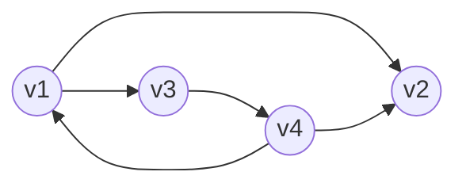

## 十字链表
**有向图的一种链式存储结构**
- 在邻接表中获取有向图的入边是很不方便的，需要遍历。因此引入十字链表。
在十字链表中，对应于有向图中的每条弧有一个结点，对应于每个顶点也有一个结点。
（a）弧结点：`tailvex`、`headvex`、`hlink`、`tlink`、`info`
（b）顶点结点：`data`、`firstin`、`firstout`
- `tailvex`：弧尾顶点编号
- `headvex`：弧头顶点编号
- `hlink`：弧头相同的下一条弧
- `tlink`：弧尾相同的下一条弧
- `info`：该弧的相关信息
- `data`：存放顶点相关数据信息
- `firstin`：该顶点作为弧头的第一条弧
- `firstout`：该顶点作为弧尾的第一条弧
有向图（4 个顶点，5 条弧）：v1→v2、v1→v3、v3→v4、v4→v1、v4→v2

> [!tip] 总结
> 在十字链表中，既容易找到Vi为尾的弧，又容易找到Vi为头的弧，因而容易求得顶点的出度和入度。图的十字链表表示是不唯一的，但一个十字链表表示确定一个图。
