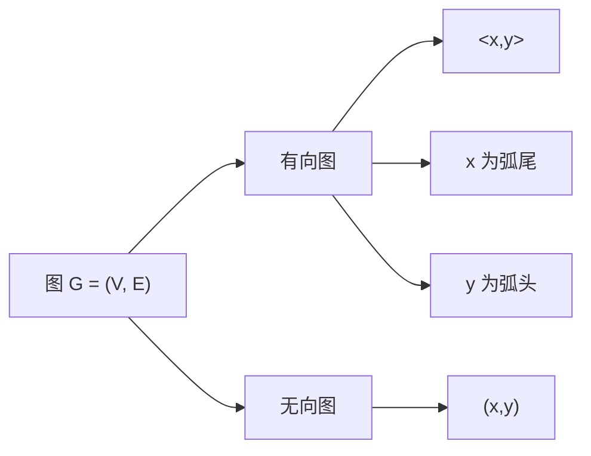
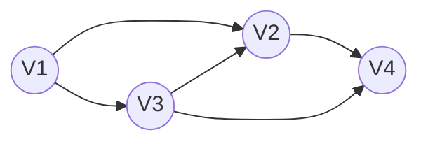
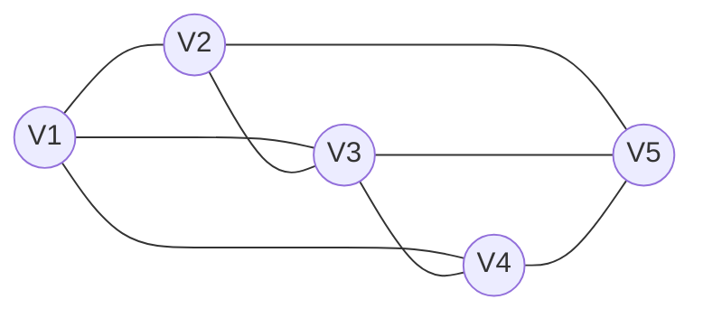
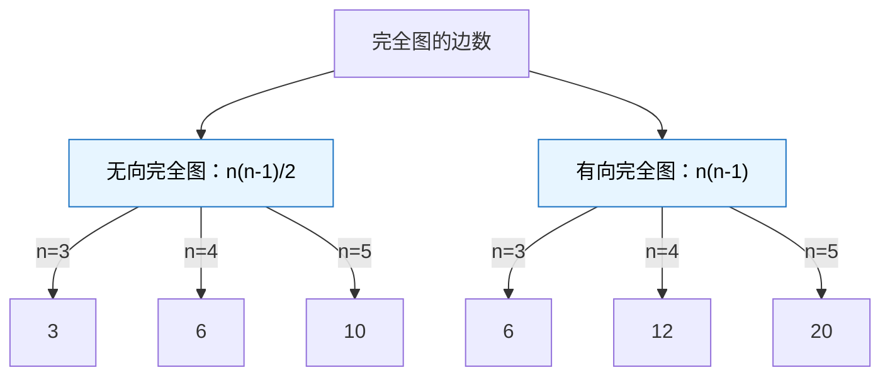
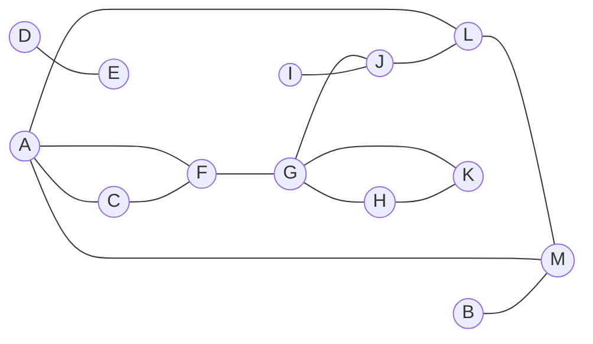
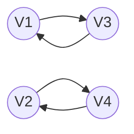
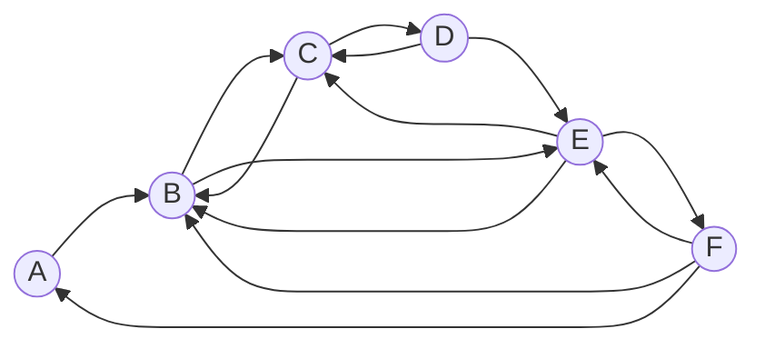
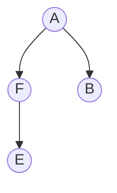
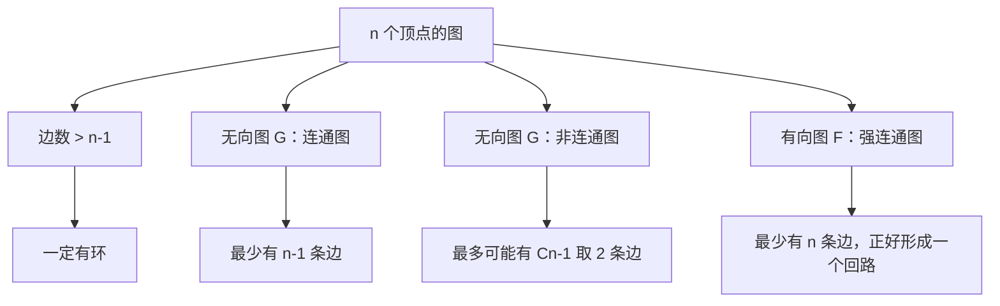
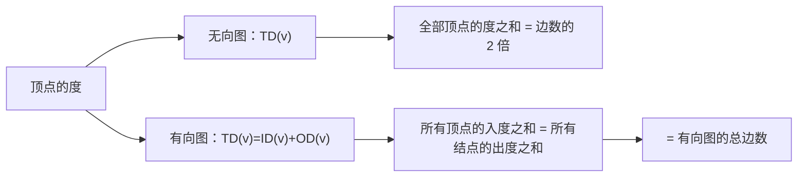

## 图的基本概念

| 考点 | 摘要 |
| --- | --- |
| **[[图#图的定义\|图的定义]]** | 图由顶点集 $V$ 与边集 $E$ 组成，记为 $G=(V,E)$，$V$ 是有穷**非空**集合，$E$ 可以为空。$\|V\|$ 为图的阶，$\|E\|$ 为边数。有向图边用 $<x,y>$ 表示，$x$ 为弧尾、$y$ 为弧头；无向图边用 $(x,y)$ 表示。$<x,y>$ 与 $<y,x>$ 是两条边，$(x,y)$ 与 $(y,x)$ 是同一条边。 |
| **[[图#图的分类\|图的分类]]** | 简单图不存在重复边与自环；多重图允许。无向完全图有 $n(n-1)/2$ 条边，有向完全图有 $n(n-1)$ 条弧。边很少的称稀疏图，反之称稠密图。 |
| **[[图#权和网、邻接点、路径、回路\|权和网、邻接点、路径、回路]]** | 边上带数值的图称为网，该数值称为权；同处边两侧的顶点互为邻接点。路径是顶点序列，路径长度是路径上边的数目（带权路径长度取边权之和）。首尾顶点相同的路径称为回路，顶点不重复的路径称简单路径，除首尾外顶点不重复的回路称简单回路。 |
| **[[图#子图、连通分量、强连通分量\|子图、连通分量、强连通分量]]** | $V'\subseteq V$ 且 $E'\subseteq E$ 时 $G'$ 是 $G$ 的子图。无向图的极大连通子图称连通分量，有向图的极大强连通子图称强连通分量。 |
| **[[图#生成树和生成森林\|生成树和生成森林]]** | 连通图的生成树是含全部顶点、边最少的极小连通子图，$n$ 个顶点的生成树含 $n-1$ 条边；去掉一条边变为非连通，加一条边形成回路。非连通图中，连通分量的生成树构成生成森林。有向树只有一个顶点入度为 0、其余入度均为 1。 |
| **[[图#几个性质\|几个性质]]** | $n$ 个顶点、边数大于 $n-1$ 的图一定有环；$n$ 个顶点的无向连通图最少 $n-1$ 条边，非连通图最多 $C_{n-1}^2$ 条边；$n$ 个顶点的有向强连通图最少 $n$ 条边，正好形成一个回路。 |
| **[[图#顶点的度\|顶点的度]]** | 无向图中顶点 v 的度是依附于它的边数，全部顶点的度之和等于边数的 2 倍；有向图中 TD(v)=ID(v)+OD(v)，入度之和等于出度之和，且等于总边数。 |

### 图的定义
- **图**：由两个集合 $V$ 和 $E$ 组成，记为 $G=(V,E)$，其中 $V$ 是顶点的有穷**非空**集合，$E$ 是表示图中顶点之间关系（边）的有穷集合。

> [!warning] 注意
> 用 $|V|$ 表示图 $G$ 中顶点的个数也称图的阶。用 $|E|$ 表示图 $G$ 中边的条数。

> [!warning] 注意
> $V(G)$ 和 $E(G)$ 通常分别表示图 $G$ 的顶点集合和边集合，$E(G)$ 可以为空集。若 $E(G)$ 为空，则图 $G$ 只有顶点而没有边。

| 类型 | 定义 |
| --- | --- |
| **有向图** | 边集 $E(G)$ 为有向边的集合，边用 $<x,y>$ 表示有序，即从顶点 $x$ 到顶点 $y$ 的有向边。$<x,y>$ 也称作一条弧，$x$ 为弧尾，$y$ 为弧头。 |
| **无向图** | 边集 $E(G)$ 为无向边的集合，边用 $(x,y)$ 表示，即与顶点 $x$ 和顶点 $y$ 相关联的一条边。 |

> [!warning] 注意
> $<x,y>$ 与 $<y,x>$ 是不同的两条边，$(x,y)$ 与 $(y,x)$ 是同一条边。

### 图的分类

| 类型 | 定义 |
| --- | --- |
| **简单图** | 简单图指不存在重复边，且不存在顶点到自身的边的图。一般默认图为简单图。 |
| **多重图** | 某两个结点之间的边数多于一条，且允许存在顶点到自身的边。 |
| **完全图** | 对于无向图，若具有 $n(n-1)/2$ 条边，则称为无向完全图，在完全图中任意两个顶点之间都存在边。对于有向图，若具有 $n(n-1)$ 条弧，则称为有向完全图，在有向完全图中任意两个顶点之间都存在方向相反的两条弧。 |
| **稀疏图和稠密图** | 有很少条边或弧的图称为稀疏图，反之称为稠密图。 |

有向图（4 个顶点）：

无向图（5 个顶点）：

完全图的边数（无向图 / 有向图）：

### 权和网、邻接点、路径、回路

| 术语 | 定义 |
| --- | --- |
| **权和网** | 在实际应用中，每条边可以标上具有某种含义的数值，该数值称为该边上的权。这些权可以表示从一个顶点到另一个顶点的距离或耗费。这种带权的图通常称为网。 |
| **邻接点** | 同处边两侧的顶点相衔接，互为邻接点。 |
| **路径** | 顶点 p 到顶点 q 之间的一条路径是指其经过的顶点序列。顶点之间可能不存在路径。 |
| **路径长度** | 路径上边的数目称为路径长度。带权路径长度（路径上所有边权值之和）。 |
| **回路** | 第一个顶点和最后一个顶点相同的路径称为回路或环。 |
| **简单路径** | 路径序列中顶点不重复出现的路径称为简单路径。 |
| **简单回路** | 除了第一个顶点和最后一个顶点之外，其余顶点不重复出现的回路。 |

### 子图、连通分量、强连通分量

| 术语 | 定义 |
| --- | --- |
| **子图** | 假设有两个图 G =(V, E) 和 G' = (V' , E' )，如果 V' $\subseteq$ V 且 E' $\subseteq$ E，则称 G' 为 G 的子图。 |
| **连通分量** | 无向图中的极大连通子图（子图必须连通，且包含尽可能多的顶点和边）称为连通分量。 |
| **强连通分量** | 有向图中的极大强连通子图（子图必须强连通并包含尽可能多的边）称为强连通分量。 |

无向图的连通分量（极大连通子图：A、C、F、G、H、I、J、K、L、M、B；另一个极大连通子图：D、E）

有向图的强连通分量（极大强连通子图：V1、V2、V3、V4）

有向图的强连通分量（极大强连通子图：V1、V3；另一个极大强连通子图：V2、V4）

### 生成树和生成森林

| 术语 | 定义 |
| --- | --- |
| **连通图的生成树** | 一个极小连通子图，它含有图中全部顶点，包含最少边。生成树可能有多个。 |
| **非连通图的生成森林** | 在非连通图中，连通分量的生成树构成它。 |
| **有向树** | 有一个顶点的入度为 0，其余顶点的入度均为 1 的有向图称为有向树。 |
| **一个有向图的生成森林** | 由若干棵有向树组成，含有图中全部顶点，但只有足以构成若干棵不相交的有向树的弧。 |

> [!warning] 注意
> 若图中顶点数为 n，则它的生成树含有 n-1 条边。对生成树若去掉一条边则会变为非连通图，若加一条边则会形成一个回路。

一个有向图（A、B、C、D、E、F）：

有向图的生成森林（有向树 1，根 A；有向树 2，根 D）：

### 几个性质
1. 若一个图有 n 个顶点，并且有大于 n-1 条边，则此图一定有环。
2. 对于 n 个顶点的无向图 G，若 G 为连通图，则最少有 n-1 条边；
3. 对于 n 个顶点的无向图 G，若 G 为非连通图，则最多可能有 $C_{n-1}^2$ 条边。
4. 对于 n 个顶点的有向图 F，若 F 为强连通图，则最少有 n 条边，正好形成一个回路。

### 顶点的度
1. 对于无向图，顶点 v 的度是指依附于该顶点的边的条数，记为 TD(v)，无向图的全部顶点的度之和等于边数的 2 倍。
2. 对于有向图，顶点 v 的度分为入度和出度。入度是以顶点 v 为头的弧的数目，记为 ID(v)；出度是以顶点 v 为尾的弧的数目，记为 OD(v)。顶点 v 的度为 TD(v)=ID(v)+OD(v)，所有顶点的入度之和等于所有结点的出度之和，且等于有向图的总边数。

## 相关
- 图的存储
  - [[图的存储结构]]
  - [[邻接矩阵]]
  - [[邻接表]]
  - [[十字链表]]
  - [[邻接多重表]]
- [[图的基本操作]]
- 图的遍历
  - [[广度优先遍历BFS]]
