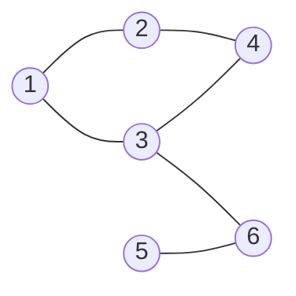
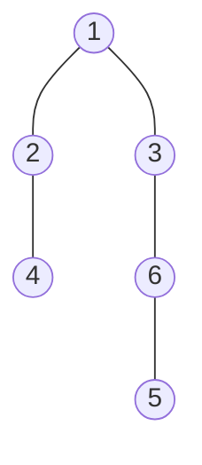

## 广度优先遍历BFS
- 首先回忆二叉树的层次遍历，是一层一层的遍历，换句话说就是先顺序遍历离根结点距离为1的结点，然后顺序遍历离根结点距离为2的结点，以此类推。BFS亦是如此。
以v为起始点，**由近至远依次访问和v有路径相通且路径长度为1，2，...的顶点**。或理解为首先**访问起点v中未访问过的邻接点**，然后再**依次访问这些邻接点的邻接顶点**，直至访问完，若此时图中尚有顶点未被访问，则另选图中一个未曾被访问的顶点作为始点，**重复上述过程**。
## 实现思路

> [!question] 问题
> 对于图如何实现这一过程？

> [!question] 思考
> 树和图目标一样，实现过程中相同的总是通过已有的找到后续的结点。

- 对于树来说，可以通过左右指针直接找到左右孩，并且树中不存在回路，不可能存在遍历已经访问过的结点。
- 对于图来说，可以通过前面学到的基本操作找到其相邻的顶点，但是**有可能搜到已经访问过的顶点**。如 FirstNeighbor(G,x)找顶点x的第一个邻接点，NextNeighbor(G,x,y)找下一个邻接点。

> [!note] 解决方案
> 给图中顶点搞一标记，来表示是否被访问过。并且**设置辅助队列以记忆正在访问的顶点的下一层顶点**。

```c
void BFS(Graph G，int v){ //从顶点v出发，广度优先遍历图G
	visit(v); //访问初始顶点 v
	visited[v]=TRUE; //对v做已访问标记
	Enqueue(Q,v); //顶点v入队列Q
	while(!isEmpty(Q)){
		DeQueue(Q,v); //顶点v出队列
		for(w=FirstNeighbor(G,v); w>=0; w=NextNeighbor(G,v,w))
		//检测v的所有邻接点
			if(!visited[w]){ //w为v的尚未访问的邻接顶点
				visit(w); //访问顶点w
				visited[w]=TRUE; //对w做已访问标记
				Enqueue(Q,w); //顶点w入队列
			}
	}
}
```

> [!tip] 总结
> 如果图是非连通图，则无法遍历完所有结点。

> [!note] 解决方案
> 当执行完一次BFS遍历后，再重新探查所有顶点的visit值是否全为true。

- 你会发现，对于无向图，**调用BFS函数的次数为连通分量数**。

```c
void BFSTraverse(Graph G){ //对图G进行广度优先遍历
	for(i=0;i<G.vexnum;++i)
		visited[i]=FALSE; //访问标记数组初始化
	InitQueue(Q); //初始化辅助队列Q
	for(i=0;i<G.vexnum;++i) //从第一个顶点开始遍历
		if(!visited[i]) //对每个连通分量调用一次BFS
			BFS(G,i); //vi未访问过，从vi开始 BFS
}
```

## 算法性能分析
1. **空间复杂度**：无论是邻接表还是邻接矩阵的存储方式，BFS算法都需要借助一个辅助队列Q，n个顶点均需入队一次，在最坏的情况下，空间复杂度为O(|V|)。
2. **时间复杂度**：
**对于邻接矩阵存储的图**：

访问|V|个顶点需要O(|V|)的时间，查找每个顶点的邻接点所需的时间为 O(|V|)，故算法总的时间复杂度为O(|V|²)。

**对于邻接表存储的图**：

访问|V|个顶点需要O(|V|)的时间，查找所有顶点的邻接点所需的时间为 O(|E|)，总的时间复杂度为O(|V|+|E|)。
## 广度优先生成树
以顶点 1 为起点，图的邻接表为：
- 1：2, 3
- 2：1, 4
- 3：1, 4, 6
- 4：2, 3
- 5：6
- 6：3, 5
原图（6 个顶点，6 条边）：



广度优先生成树（从顶点 1 出发）：



一给定图的邻接矩阵存储表示是唯一的，故其广度优先生成树也是唯一的，但**由于邻接表存储表示不唯一，故其广度优先生成树也是不唯一的**。

对非连通图的广度优先遍历，可得到广度优先生成森林。
