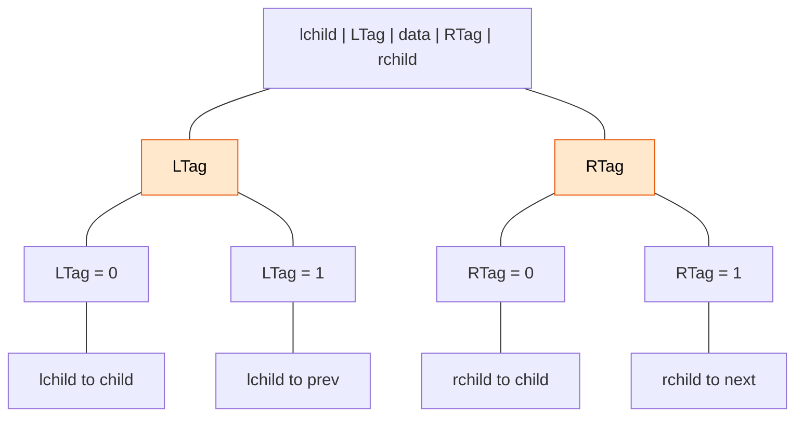

> [!abstract] 线索
> - 用空链域来存储前驱后继信息
> - 线索：这些指向前驱后继的指针称为线索，对二叉树以某种次序遍历使其变为线索二叉树的过程叫做线索化

> [!note] 标志域
> - 在二叉链的基础上，并不能清晰地分清楚现在指针指向的是左孩子还是前驱。
> - 为了避免混乱，在结点中增加两个标志域来区分指针域是指向孩子还是线索。



| `lchild` | `LTag` | `data` | `RTag` | `rchild` |
|:---:|:---:|:---:|:---:|:---:|

当 `tag` 为 `0` 时表示指向孩子，为 `1` 时表示线索。以这种结点结构构成的二叉链表作为二叉树的存储结构，叫作线索链表。

```cpp
typedef struct ThreadNode {
    ElemType data; // 数据元素
    struct ThreadNode *lchild, *rchild;
    int LTag, RTag; // 左右标志
} ThreadNode, *ThreadTree;
```

## 三种线索化

### [[二叉树的中序线索化]]

### [[二叉树的先序线索化]]

### [[二叉树的后序线索化]]
