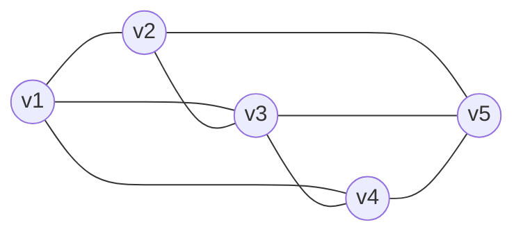

## 邻接多重表

> [!note] 背景
> 存储无向图，邻接矩阵所需空间复杂度O(|V|²)较大，用邻接表每条边对应两个，那么对应删除操作就需要较为麻烦。所以针对无向图引入邻接多重表。

**无向图的另一种链式存储结构。** 每条边和每个顶点用一个结点表示。

（a）边结点：`mark`、`ivex`、`ilink`、`jvex`、`jlink`、`info`

（b）顶点结点：`data`、`firstedge`
- `mark`：标志域，记录此边是否被搜索过
- `ivex/jvex`：边的两个顶点编号
- `ilink`：下一条依附于顶点ivex的边
- `jlink`：下一条依附于顶点jvex的边
- `data`：数据域
- `firstedge`：与该顶点相连的第一条边
无向图（5 个顶点，8 条边）：v1—v2、v1—v3、v1—v4、v2—v3、v2—v5、v3—v4、v3—v5、v4—v5

> [!tip] 总结
> 每条边只对应一份数据，空间复杂度为O(|V|+|E|)，删除边、结点等操作较为方便。
