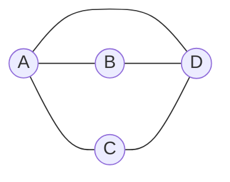
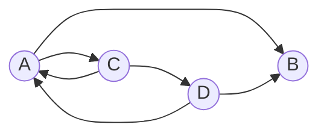
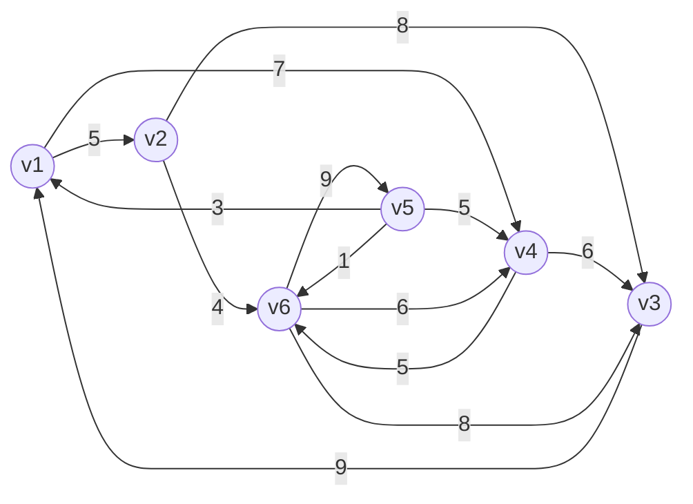
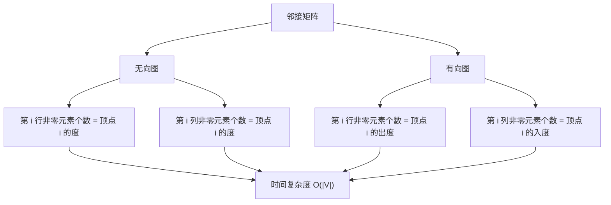

## 邻接矩阵
指用一个一维数组存储图中顶点的信息，用一个二维数组存储图中边的信息（即各顶点之间的邻接关系），存储顶点之间邻接关系的二维数组称为邻接矩阵。
### 图数据类型描述

```c
#define MVNum 100 //最大顶点数
typedef struct
{
Elemtype Vex[MVNum]; //顶点表
Elemtype Edge[MVNum][MVNum]; //邻接矩阵,边表
int vexnum,arcnum; //图的当前点数和边数
} MGraph;
```

> [!question] 问题
> 如果用来描述带权图怎么办呢？

- 邻接矩阵可记录权值，没有权值用无穷或0表示。

> [!warning] 注意
> 二维数组中，1代表有边的关系，0代表没边。

无向图（A、B、C、D）：



无向图的邻接矩阵：

| | A | B | C | D |
|:---:|:---:|:---:|:---:|:---:|
| **A** | 0 | 1 | 1 | 1 |
| **B** | 1 | 0 | 0 | 1 |
| **C** | 1 | 0 | 0 | 1 |
| **D** | 1 | 1 | 1 | 0 |

有向图（A、B、C、D）：



有向图的邻接矩阵：

| | A | B | C | D |
|:---:|:---:|:---:|:---:|:---:|
| **A** | 0 | 1 | 1 | 0 |
| **B** | 0 | 0 | 0 | 0 |
| **C** | 1 | 0 | 0 | 1 |
| **D** | 1 | 1 | 0 | 0 |

### 带权图
带权有向图（6 个顶点 v1~v6，13 条弧：v1→v2 为 5、v1→v4 为 7、v2→v3 为 8、v2→v6 为 4、v3→v1 为 9、v4→v6 为 5、v4→v3 为 6、v5→v1 为 3、v5→v4 为 5、v5→v6 为 1、v6→v3 为 8、v6→v5 为 9、v6→v4 为 6）：



邻接矩阵：

| | v1 | v2 | v3 | v4 | v5 | v6 |
|:---:|:---:|:---:|:---:|:---:|:---:|:---:|
| **v1** | ∞ | 5 | ∞ | 7 | ∞ | ∞ |
| **v2** | ∞ | ∞ | 8 | ∞ | ∞ | 4 |
| **v3** | 9 | ∞ | ∞ | ∞ | ∞ | ∞ |
| **v4** | ∞ | ∞ | 6 | ∞ | ∞ | 5 |
| **v5** | 3 | ∞ | ∞ | 5 | ∞ | 1 |
| **v6** | 8 | ∞ | ∞ | 6 | 9 | ∞ |

## 邻接矩阵法的性质
1. 对于无向图，邻接矩阵的第 i 行（或第 i 列）非零元素（或非∞的元素）的个数正好是顶点 i 的度。
2. 对于有向图，邻接矩阵的第 i 行非零元素（或非∞元素）的个数正好是顶点 i 的出度；第 i 列非零元素（或非∞元素）的个数正好是顶点 i 的入度。
3. 邻接矩阵法存储结构的空间复杂度为：O(n)+O(n²)即O(n²)，也记为O(|V|²)。

> [!warning] 注意
> 对于邻接矩阵法来说，具体开销都只与顶点数有关，和实际的边数无关。

4. 如果图中顶点很多但是边数很少会导致矩阵中0很多，浪费空间，所以此存储方法比较适合稠密图。
5. 无向图的邻接矩阵一定是一个对称矩阵。因此在实际存储时只需存储上（或下）三角矩阵的元素。
6. 用邻接矩阵存储图，很容易确定图中任意两个顶点之间是否有边相连。但是，要确定图中有多少条边，则必须按行、按列对每个元素进行检测，所花费的时间代价很大。
7. 设图G的邻接矩阵为A，$A^n$的元素 $A^n[i][j]$ 等于由顶点i到顶点j的长度为n的路径的数目。

> [!tip] 总结
> 邻接矩阵法求顶点的度/出度/入度的时间复杂度为O(|V|)。

| 属性 | 无向图 | 有向图 |
| --- | --- | --- |
| **行的非零元素个数** | 等于该顶点的度 | 等于该顶点的出度 |
| **列的非零元素个数** | 等于该顶点的度 | 等于该顶点的入度 |
| **求度的时间复杂度** | O(\|V\|) | O(\|V\|) |
| **空间复杂度** | O(\|V\|²) | O(\|V\|²) |
| **适用场景** | 稠密图 | 稠密图 |
| **对称性** | 一定是对称矩阵 | 不一定对称 |


