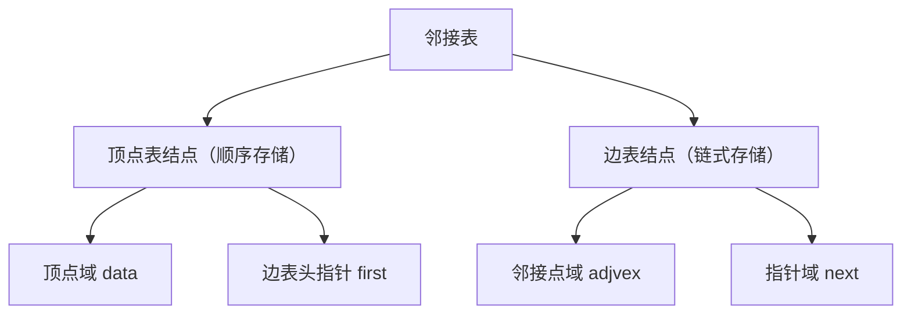
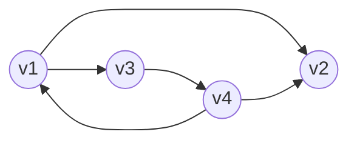
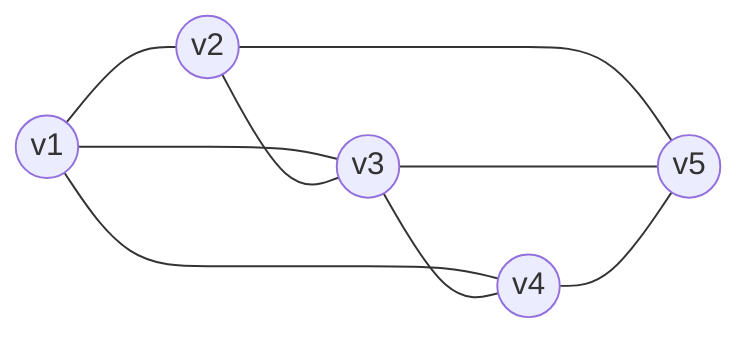

## 邻接表

> [!question] 问题
> 前面学到的邻接矩阵法是由数组实现的顺序存储，空间复杂度高，不适合存储稀疏图。

和树的孩子表示法类似，结合顺序和链式存储。

对图G中的每个顶点vi建立一个**单链表**，第i个单链表中的结点表示依附于顶点vi的边（对于有向图则是以顶点vi为尾的弧），这个单链表就称为顶点vi的**边表**（对于有向图则称为出边表）。

边表的头指针和顶点的数据信息采用顺序存储（称为**顶点表**）。

顶点表结点：顶点域 `data`，边表头指针 `first`。

边表结点：邻接点域 `adjvex`，指针域 `next`。

```c
#define MVNum 100 //图中最大顶点数
typedef struct ArcNode { //边表结点
	int adjvex; //该边所指向的顶点的位置
	struct ArcNode *next; //指向下一条边的指针
	Otherinfo info; //和边相关的信息
}ArcNode;

typedef struct VNode{ //顶点表结点
	VerTexType data; //顶点信息
	ArcNode *first; //指向第一条依附该顶点的边的指针
}VNode, AdjList[MVNum]; //AdjList表示邻接表类型

typedef struct {
	AdjList vertices; //邻接表
	int vexnum,arcnum; //图的顶点数和边数
}ALGraph; //ALGraph是以邻接表存储的图类型
```



## 邻接表法的性质
1. 若G为无向图，则所需的存储空间为O(|V|+2|E|)；若G为有向图，则所需的存储空间为O(|V|+|E|)。前者的倍数2是由于无向图中，每条边在邻接表中出现了两次。
2. 对于无向图，找到邻接表中某顶点对应的边链表即可找到相连的边以及其度。对于有向图，要求出度，只需找到对应边链表即可。但如果想找到指向某一顶点的弧或此结点的入度，则需要遍历所有顶点对应的边链表，并不方便。
3. 图的邻接表表示方式并不唯一。因为在每个顶点对应的单链表中，各边结点的链接次序可以是任意的，它取决于建立邻接表的算法及边的输入次序。

> [!warning] 注意
> 在邻接矩阵法中，只要确定了顶点编号，图的邻接矩阵表示方式唯一。

4. 对于稀疏图，采用邻接表表示将极大地节省存储空间。
有向图（4 个顶点，5 条弧）：v1→v2、v1→v3、v3→v4、v4→v1、v4→v2



有向图的邻接表（出边表）：

| 顶点 | 边表（出边） |  |  |
|:---:|:---:|:---:|:---:|
| **0 v1** | 2 | 1 | ∧ |
| **1 v2** | ∧ |  |  |
| **2 v3** | 3 | ∧ |  |
| **3 v4** | 0 | 1 | ∧ |

无向图（5 个顶点，8 条边）：v1—v2、v1—v3、v1—v4、v2—v3、v2—v5、v3—v4、v3—v5、v4—v5



无向图的邻接表（邻接点按序号升序排列）：

| 顶点 | 边表 |  |  |  |
|:---:|:---:|:---:|:---:|:---:|
| **0 v1** | 1 | 2 | 3 | ∧ |
| **1 v2** | 0 | 2 | 4 | ∧ |
| **2 v3** | 0 | 1 | 3 | 4 |
| **3 v4** | 0 | 2 | 4 | ∧ |
| **4 v5** | 1 | 2 | 3 | ∧ |
