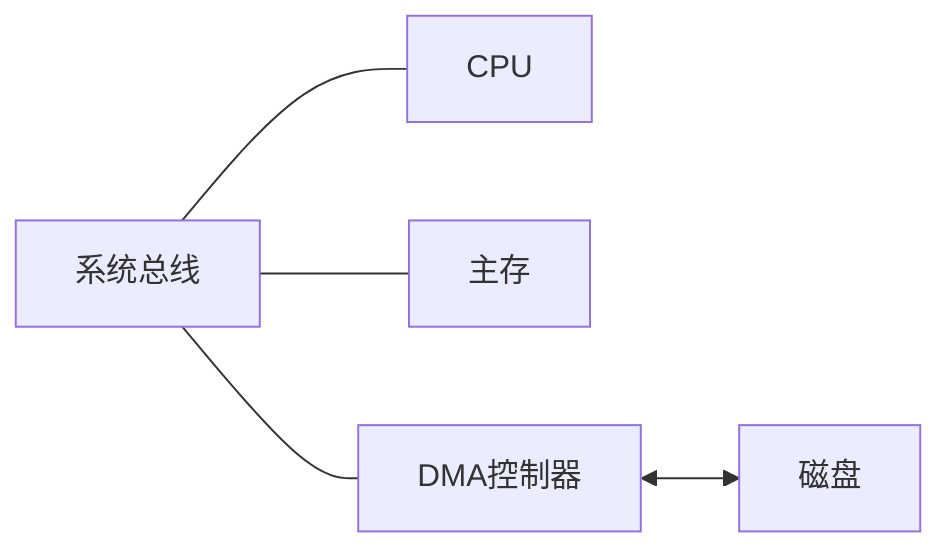

## DMA方式

> [!note] 背景
> 对于程序查询还是程序中断方式，数据都是以一个字一个字进行传输，并且每次传输都需要CPU介入，才能和主存交换，频率非常高，会消耗很多的CPU时间。
> →可在主存和外设之间建立一条直接的数据通路，数据流转不通过CPU。

### DMA直接存储器存取方式
信息传送不经过CPU，直接从外设和主存之间进行交换，降低CPU的介入频率。

> [!warning] 注意
> DMA是完全由硬件控制的数据传输方式，引入一个专用的DMA控制器来实现。

### DMA控制器的组成
![[DMA控制器组成-计组.jpg|760]]

部件与信号（按原图文字）：系统总线 / 内存 / CPU / DMA控制器 / 中断机构 / 控制状态逻辑 / DMA请求标志 / 存储地址计数器 / 字计数器 / 数据缓冲寄存器 / 设备选择 / 设备 / 中断请求 / HOLD / HLDA / DMA响应 / DMA请求 / 溢出信号 / 数据线 / 地址线 / 一字传送 / 结束信号 / 数据

#### 控制/状态逻辑
由控制和时序电路及状态标志组成，用于修改内存地址计数器和字计数器，指定传送类型(输入或输出)，并对“DMA请求”信号和CPU响应信号进行协调和同步。

#### DMA请求标志
每当设备准备好一个数据字后给出一个控制信号，使“DMA请求”标志置“1”。该标志置位后向“控制/状态”逻辑发出DMA请求，后者又向CPU发出总线使用权的请求(HOLD)，CPU响应此请求后发回响应信号HLDA，“控制/状态”逻辑接收此信号后发出DMA响应信号，使“DMA请求”标志复位，为交换下一个字做好准备。

#### 内存地址计数器
存放待传送数据的主存地址。传送前，保存整批数据的起始地址；每传送一个字，其内容自动加1，直至该批数据传送完毕。

#### 字计数器
其内容也是在数据传送之前由程序预置，交换的字数通常以补码形式表示。在DMA传送时，每传送一个字，字计数器就加1，当计数器溢出即最高位产生进位时，表示这批数据传送完毕，于是引起DMA控制器向CPU发中断信号。

#### 数据缓冲寄存器
暂存每次传送的数据。通常，DMA控制器与主存之间以字为单位而与外设之间可能以字节或字为单位。

#### 中断机构
当字计数器溢出时(全0)，意味着一组数据交换完毕，由溢出信号触发中断机构，向CPU提出中断报告。

### DMA的传送过程
#### 预处理
CPU通过执行几条输入输出指令来完成必要的初始化工作，包括设置DMA控制器中的主存起始地址、传送方向、传送数据个数，并启动I/O设备。随后，CPU继续执行原程序。当I/O设备准备好待发送（输入）或接收（输出）的数据时，会向DMA控制器发出DMA请求。DMA控制器随即向CPU发出总线请求，申请总线控制权。

#### 数据传送
DMA以数据块为单位进行传送。一旦获得总线控制权，DMA控制器便通过硬件循环自动完成数据的输入或输出操作，整个过程无须CPU干预。

#### 后处理
数据块传送完后，DMA控制器向CPU发出中断请求，CPU响应执行中断服务程序，进行一些DMA的结束工作，包括校验送入主存的数据是否正确完整、决定是否继续用DMA传输其他数据块。

### DMA的访问方式
> [!question] 问题
> DMA可以通过DMA总线直接访问主存，而CPU也可以直接访问主存，当CPU和DMA同时访问主存时，可能发生冲突，如何安排访问顺序？

#### CPU停止访问主存法
当I/O设备发出DMA请求时，DMA控制器向CPU发送停止信号，使CPU放弃总线控制权并暂停访存，直至DMA完成整块数据的传送，DMA控制器才把总线控制权交回CPU。在DMA操作期间，CPU处于保持状态，停止访问主存，仅能进行一些与总线无关的内部操作。

> [!tip] 特点
> 优点是控制逻辑简单，适用于高速设备成组传送。缺点是DMA访存期间，CPU基本空闲，资源利用率低。

![[DMA访问方式-CPU停止访问主存法.jpg|760]]

#### 周期挪用（窃取）
允许I/O设备挪用一个主存存储周期，传送完一个数据字后立即释放总线。
当I/O设备发起DMA请求时：
1. CPU当前不在访存，无冲突，直接使用总线。
2. CPU正在访存，则需等待当前存储周期结束，再释放总线控制权。
3. 和CPU同时请求访存，CPU暂时放弃总线控制，让I/O访存优先。
→对于外设的数据输入，数据缓冲器的数据不及时读出，就会被覆盖，CPU等一下没啥，I/O最好不等以防数据丢失。

#### DMA与CPU交替访存
将CPU工作周期划分为两个子周期，一个供CPU访存，另一个供DMA访存。在每个CPU周期内，两者可以轮流访问主存。该方式适用于CPU工作周期长于主存存储周期的场景。

> [!warning] 注意
> 由于大多数外设的速度都不能与CPU相匹配，所以供DMA使用的时间片可能成为空操作，将会造成一些不必要的浪费。

![[DMA访问方式-DMA与CPU交替访存.jpg|760]]

> [!tip] 总结
> DMA方式的特点：
> 1. 主存既可被CPU访问，又可被外设直接访问。
> 2. 在块数据传输过程中，主存地址的生成与传送字数的计数均由硬件电路自动完成。
> 3. 支持高速数据传输，且CPU与外设可并行工作，显著提升系统效率。
> 4. 传输开始前需由软件进行预处理，结束后则通过中断机制完成后处理。
> 5. 在DMA方式下，整个数据块的传送过程均由硬件完成，CPU仅在预处理阶段进行初始化，在后处理阶段响应中断，因此用于I/O的开销极小。
> 6. 主存中需设置专用缓冲区，以支持高效的数据交换。

> [!tip] 总结
> DMA方式和中断方式的对比：
> 1. 中断方式是程序切换，需要保护和恢复现场；而DMA方式除了开始和结尾时，不占用CPU的任何资源。
> 2. 对中断请求的响应只能发生在每条指令执行完毕时；而对DMA请求的响应可以发生在每个机器周期结束时，总线空闲时即可。
> 3. 中断传送过程需要CPU的干预，适用于低速设备；而DMA传送过程不需要CPU的干预，故数据传送速率非常高，适合于高速外设的成组数据传送。
> 4. 中断方式具有对异常事件的处理能力；而DMA方式仅局限于完成传送信息块的I/O操作。
> 5. 从数据传送来看，中断方式由软件控制传送，DMA方式由硬件直接完成。

## 相关
- [[DMA方式]]
- [[程序中断方式]]
