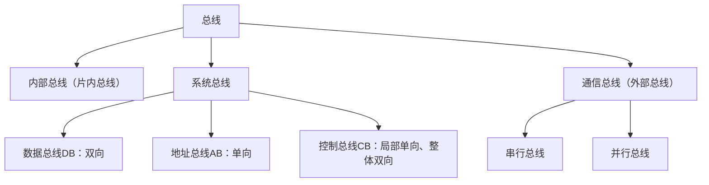

## 总线分类
系统中存在多种类型的总线，这种bus的思想应用在多个方面（如网络拓扑）
### 内部总线
指芯片内部的总线，也称片内总线，用于CPU内部各寄存器之间以及ALU之间的连接。
### 系统总线
计算机系统内部各功能部件（CPU、内存、I/O接口）之间相互连接的总线。根据传输内容不同分为：
- **数据总线DB**：双向传输数据信息，包括指令、操作数、状态字、中断类型号等。
- 其根数反映了CPU一次能并行传输的数据位数，与机器字长、存储字长有关。
- **地址总线AB**：单向传输，用于指定要访问的主存单元或I/O端口的地址。
- 其根数决定了系统的最大可寻址空间。

> [!warning] 注意
> 为减少芯片引脚数量并降低成本，有时可采用地址线和数据线复用技术，将地址和数据信息分时在一组线上传输。

- **控制总线CB**：用于传输各种控制信号，以确保各部件同步有序的工作，一根控制线传输一个信号。
- 对于单根控制总线传输是单向的，由CPU向各部件发出控制命令；对整体控制总线来说可认为是双向的，如某设备准备就绪时，便向CPU发出中断请求。【局部单向整体双向】

> [!warning] 注意
> 典型信号包括时钟、复位、总线请求/允许、中断请求/响应、存储器读/写、I/O读/写、传输确认等。

### 通信总线
用于计算机系统之间或计算机系统与其他系统之间信息传送的总线，也称外部总线。
按照传输方式的不同，还可分为：
1. **串行总线**：指数据在单条1位宽的传输线上，一位一位按顺序传送。

> [!tip] 优点
> 成本低，广泛用于长距离传输（价格低、干扰小）。用于计算机内部时，可节省内部布线空间。

> [!warning] 缺点
> 需数据拆配，考虑串行和并行转换的问题。

2. **并行总线**：指数据在多条并行1位宽的传输线上同时发送。

> [!tip] 优点
> 时序控制较简单，在短距离内，并行数据传送速率比串行数据传送速率高得多。

> [!warning] 缺点
> 信号线数量多，占用空间，远距离传送成本高（干扰多）。

