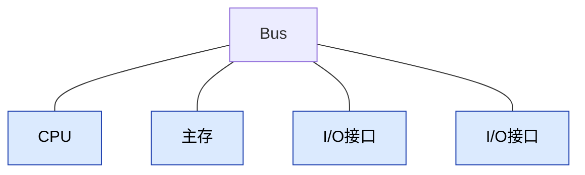
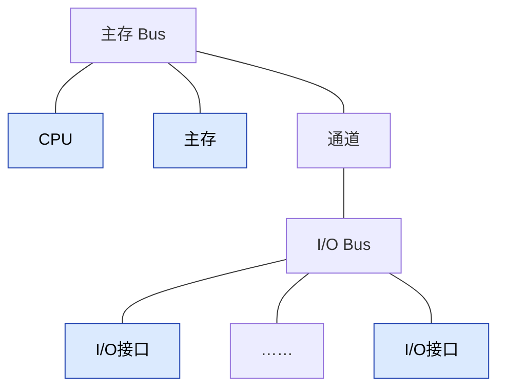

## 总线的结构

> [!note] 背景
> 需要学习系统总线的总线结构。

### 早期单总线结构
CPU、主存、I/O设备（通过I/O接口）都连接在一组总线上，允许I/O设备之间、I/O设备和CPU之间或I/O设备与主存之间直接交换信息。
- 系统的设备传输速度有高有低，但是都挂在同一条总线上，数据传输速度基本就和最慢的设备速度一样了。

> [!tip] 优点
> 结构简单，成本低，易于接入新的设备。

> [!warning] 缺点
> 多个部件只能争用唯一的总线，造成数据传输带宽低，负载重，且不支持并发传送操作。

### 双总线结构
双总线结构有两条总线，一条是主存总线（可支持猝发传送），用于CPU、主存和通道之间进行数据传送；另一条是I/O总线，用于多个外部设备与通道之间进行数据传送。

> [!warning] 注意
> 通道是具有特殊功能的处理器，能对I/O设备进行统一管理。通道比较快，可和CPU相连。

> [!tip] 优点
> 使CPU和主存的数据交换独立于I/O通路，使低速设备对高速设备的数据传输影响缩小。

> [!warning] 缺点
> I/O设备若需要和主存交换数据，仍要通过CPU中转。

### 三总线结构
进一步增加DMA（直接内存访问）总线，允许高速I/O设备通过DMA控制器直接与主存通信，无须CPU干预。

> [!tip] 优点
> DMA总线的引入使得部分高速I/O设备可以直接访问主存，使得传输速率进一步提高。

> [!warning] 缺点
> DMA控制器的引入使得硬件设计更为复杂。

![[总线结构-三总线.canvas]]
