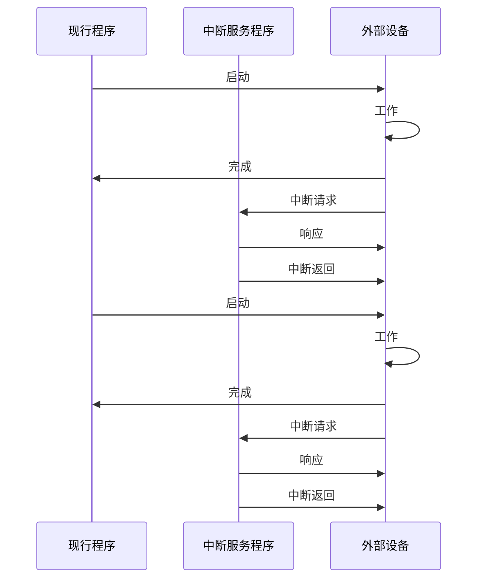

## 程序中断方式

> [!note] 背景
> 程序查询方式有CPU有“踏步”等待现象，CPU与I/O串行工作。
> →本质原因还是因为CPU不知道I/O设备什么时候准备好，所以需要不断的查询。
> →引入中断机制，在I/O设备准备就绪时通过中断的方式告诉CPU。

### 程序中断方式
当前进程发起I/O操作时，会启动相应外设，并主动进入阻塞状态。CPU随即转而执行就绪队列中的另一进程，实现外设与CPU的并行工作。外设完成数据准备后，主动向CPU发出中断请求。CPU响应后，暂停当前指令流，保存现场，并转入中断服务程序，完成主机与外设之间的数据传送。数据传送结束后，CPU恢复被中断进程的现场，并返回断点继续执行。

> [!note] 补充
> 根据操作系统I/O管理的不同方式。过程也可描述为：
> 在程序中断传送方式中，通常在程序中安排一条指令，发出START信号启动I/O设备，然后机器继续执行程序，此时I/O处于准备数据的过程。当I/O设备在做好输入/输出准备时，向主机发中断请求，主机接到请求后就暂时中止原来执行的程序，转去执行中断服务程序，在中断服务程序中完成输入/输出操作，在中断处理完毕后，CPU将自动返回原来的程序继续执行。

### 特点
1. 数据传输的基本单位是字节或者字，每传输一个字或者字节都需要一次中断，CPU介入频繁。
→在传输数据时，是CPU的寄存器-数据缓冲寄存器-外设的结构，不管是传出还是传入，都是经过CPU寄存器。
→每成功传输一次数据，就需要请求一次中断，让CPU来处理。
2. 相对于程序查询方式，克服了CPU忙等现象，让CPU和设备并行运行，提高了CPU的利用率和系统效率。
3. 从微观操作分析，发现CPU执行中断服务程序时仍需暂停原程序的正常运行，尤其是当高速I/O设备或辅助存储器频繁地、成批主存交换信息时，需不断地打断CPU执行主程序而执行中断服务程序，造成较大开销。
→所以，太快的数据输入就不太适合中断方式。

## 相关
- 中断判优 → [[中断判优]]
- 中断响应 → [[中断响应过程]]
- 中断服务 → [[中断服务过程]]
- 多重中断 → [[多重中断]]
