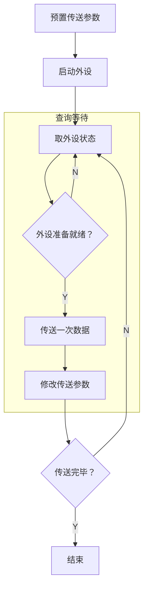

## 程序查询方式

> [!note] 背景
> CPU指示设备干活，需要等待设备准备就绪才能干活。每次传送完一次数据总要进行一段时间的处理或准备才能传送下一个数据。
- 比如要想让打印机打两个字符，先得等设备启动，才能将第一个字符送过去打印，然后还得第一个字符打印处理完才能准备第二个字符的打印准备工作。

> [!note] 引入
> 可以在执行程序中插入轮询测试指令来检测设备的工作状态，其状态ready了，再开始数据的交换。

### 程序查询方式
完全由CPU执行程序来控制数据的交换，主机进行I/O操作时，执行程序首先读取设备状态，以此决定是进行数据交换还是继续等待设备。

> [!tip] 总结
> 程序查询方式的过程：
> 1. CPU执行初始化程序，设置计数值（标识传送数据量）、内存首地址（从哪读或写）。
> 2. 向I/O接口发送命令字，启动外设。
> 3. 循环读取外设状态寄存器。
> 4. 若设备未就绪，则循环查询。
> 5. 若设备就绪，则传送一个数据。
> 6. 修改地址和计数值。
> 7. 判断传送是否完成，若未完成则回步骤3，直至计数值归零。

> [!note] 补充
> 独占查询：一旦启动外设，CPU便连续不断地查询其状态，直至操作完成，此期间CPU无法执行其他任务，处于忙等待状态，导致CPU只能和外部设备串行工作。
> 定时查询：CPU以固定时间间隔周期性地查询外设状态。每次查询时，若设备已就绪，则传送一个数据单元，随后返回用户程序继续执行。查询间隔需根据外设的数据传输速率合理设置，以避免数据丢失。

> [!note] 理解
> 如果要想输入数据，采用定时查询方式的话，就得保证必须在一个数据没被第二个数据覆盖时，来查询设备状态从而接收数据。就跟盘子里每一个钟头生成一个金元宝，你必须保证每个钟头都来拿一次，才能确保你能拿到所有的金元宝。

> [!tip] 总结
> 程序查询方式采用软件方式实现I/O设备的数据传输，设计简单、硬件开销小。
> 但需要耗费大量的时间进行查询和等待，且在同一时间段只能与一台外设通信，导致CPU与外设串行执行，效率较低。
