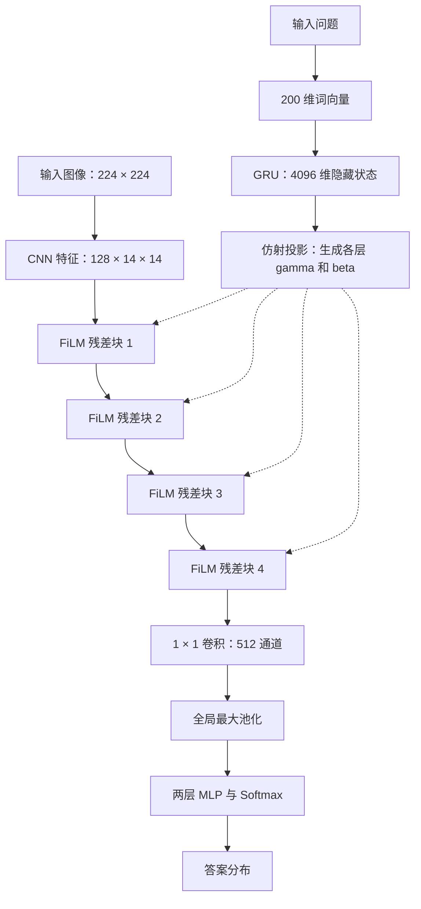

# FiLM：方法解读与总结

> [!abstract] 核心思想
> FiLM 根据条件输入，为目标网络的中间特征生成逐通道的缩放与偏移参数。对于视觉问答，条件输入是问题，目标网络是视觉 CNN：不同问题通过不同的调制参数，改变同一套视觉网络处理图像的方式。

## 1. 论文信息与阅读范围

- **标题**：FiLM: Visual Reasoning with a General Conditioning Layer
- **作者**：Ethan Perez、Florian Strub、Harm de Vries、Vincent Dumoulin、Aaron Courville
- **发表会议**：AAAI 2018
- **本地原文**：[[FiLM  Visual Reasoning with a General Conditioning Layer.pdf]]
- **主要依据**：第 2–3 页 Section 2（Method）、第 3 页 Figure 3，以及第 11 页附录 7.2（Model Details）。机制解释另参考 Section 3 和 Section 4.2。

本文区分两个层次：**FiLM 是通用条件调制方法，论文中的视觉问答网络是其具体应用。**

## 2. FiLM 的数学定义

FiLM 全称为 **Feature-wise Linear Modulation**。给定条件输入 $x_i$，生成器预测缩放参数与偏移参数：

$$
\gamma_{i,c}=f_c(x_i),\qquad \beta_{i,c}=h_c(x_i).
$$

随后对目标网络的中间特征执行：

$$
\operatorname{FiLM}(F_{i,c}\mid\gamma_{i,c},\beta_{i,c})
=\gamma_{i,c}F_{i,c}+\beta_{i,c}.
$$

其中，$i$ 表示样本，$c$ 表示特征通道；$f$ 和 $h$ 可以是神经网络，通常共享部分参数，并统称为 **FiLM generator**。被调制的目标网络称为 **FiLM-ed network**。

对于形状为 $B\times C\times H\times W$ 的 CNN 特征，展开空间维度后：

$$
\widetilde F_{i,c,h,w}
=\gamma_{i,c}F_{i,c,h,w}+\beta_{i,c}.
$$

这意味着：

1. **样本相关**：不同问题产生不同的调制参数。
2. **逐通道调制**：每个通道有自己的缩放和偏移。
3. **空间共享**：同一通道所有空间位置使用相同参数。

虽然名称中使用 Linear，但由于包含偏移项，严格来说这是一个**仿射变换**。

## 3. 缩放与偏移为什么有效？

FiLM 在论文模型中紧接 ReLU，因此实际影响可以通过下式理解：

$$
Y=\max(0,\gamma F+\beta).
$$

| 参数设置 | 对特征的影响 |
| --- | --- |
| $\gamma>1$ | 放大特征数值 |
| $0<\gamma<1$ | 缩小特征数值 |
| $\gamma<0$ | 翻转符号，改变通过 ReLU 的激活集合 |
| $\gamma=0$ | 移除原特征信息，输出变为常数 $\beta$ |
| 改变 $\beta$ | 平移激活，调整通过 ReLU 的阈值 |

当 $\gamma>0$ 时，激活通过 ReLU 的条件是：

$$
F>-\frac{\beta}{\gamma}.
$$

所以 FiLM 不仅调整特征强度，还能够控制哪些激活传递到后续网络。需要注意，$\gamma=0$ 并不必然使最终输出为零；还要看 $\beta$ 及后续激活函数。

**直观例子**：问题关注“红色物体”时，模型可以增强与相关视觉属性有关的特征，抑制无关特征。这个例子只是机制说明，并不意味着论文预先指定某个通道表示红色。

## 4. 视觉问答模型的整体结构

模型包含语言分支与视觉分支。语言分支生成参数，视觉分支使用这些参数处理图像。



### 4.1 语言分支：生成调制参数

问题中的词先映射为可学习的 200 维词向量，再输入隐藏维度为 4096 的 GRU。最后一个隐藏状态作为整个问题的表示 $q$。

各残差块的调制参数通过仿射投影生成：

$$
[\gamma^{(n)},\beta^{(n)}]=W^{(n)}q+b^{(n)}.
$$

这里是对正文描述的紧凑数学表达。实现中的缩放重参数化见第 6 节。

**所有层的调制参数都来自同一个最终问题表示**，而不是每经过一个视觉块就重新读取问题。

默认模型有 4 个残差块，每块 128 个通道，因此每个问题需要生成：

$$
4\times128\times2=1024
$$

个调制数值。这是每个样本的生成器输出数量，不是生成器自身的可学习参数总量。

### 4.2 视觉分支：提取和调制特征

输入图像缩放到 $224\times224$，转换为 $128\times14\times14$ 的视觉特征。论文提供两种特征提取方式：

- **从头训练 CNN**：4 层卷积，每层包含 128 个 $4\times4$ 卷积核，配合 BN 与 ReLU。
- **预训练特征**：使用冻结的 ImageNet 预训练 ResNet-101 的 conv4 特征，再接可学习的 $3\times3$ 卷积。

特征随后经过 4 个 FiLM 残差块。分类器使用 $1\times1$ 卷积将通道数变为 512，进行全局最大池化，再通过隐藏层为 1024 维的两层 MLP 输出答案概率。

### 4.3 空间坐标信息

为了帮助模型处理左右、上下等空间关系，作者拼接两个坐标通道，分别表示归一化到 $[-1,1]$ 的横向与纵向位置。

坐标信息加入图像特征、各残差块输入及分类器输入。它提供空间位置依据，FiLM 则通过问题决定如何调制视觉特征。

## 5. FiLM 残差块内部结构

根据 Figure 3，忽略坐标拼接后的单个残差块可以写为：

$$
U=\operatorname{ReLU}(\operatorname{Conv}_{1\times1}(X)),
$$

$$
V=\operatorname{BN}(\operatorname{Conv}_{3\times3}(U)),
$$

$$
X_{\mathrm{out}}
=U+\operatorname{ReLU}(\gamma(q)\odot V+\beta(q)).
$$

关键结构是：

$$
\operatorname{Conv}_{3\times3}\rightarrow\operatorname{BN}
\rightarrow\operatorname{FiLM}\rightarrow\operatorname{ReLU}.
$$

图中的残差支路从第一个 $1\times1$ 卷积与 ReLU 后的 $U$ 出发。

紧邻 FiLM 之前的 BN **关闭可学习的缩放与偏移参数**，但仍然执行归一化。随后由问题生成的 $\gamma,\beta$ 进行条件调制。

> [!important] FiLM 不依赖归一化
> 论文的默认结构把 FiLM 放在 BN 之后，但 FiLM 的定义只是条件仿射变换，并不要求一定存在 BN，也不要求一定紧邻归一化层。这是它相对条件归一化方法的推广。

## 6. 训练与实现要点

### 6.1 训练设置

| 项目 | 论文设置 |
| --- | --- |
| 任务监督 | 图像—问题—答案三元组 |
| 额外推理程序标签 | 不使用 |
| 优化器 | Adam |
| 学习率 | $3\times10^{-4}$ |
| 权重衰减 | $10^{-5}$ |
| Batch size | 64 |
| 训练轮数 | 最多 80 epochs |
| 模型选择 | 基于验证集准确率早停 |
| 数据增强 | 不使用 |

采用预训练 ResNet 的版本会冻结该特征提取器；“端到端训练”不意味着该版本的所有参数都从随机初始化开始更新。

### 6.2 缩放参数的重参数化

附录 7.2 说明，实现中预测的是 $\Delta\gamma$，再计算：

$$
\gamma=1+\Delta\gamma.
$$

这样可避免初始缩放系数集中在零附近，进而压低 CNN 激活及梯度。作者同时指出，这一修改对 CLEVR 性能没有统计显著的影响。

### 6.3 最小 PyTorch 表达

下面仅展示 FiLM 操作，不包含完整生成器或残差块：

```python
def film(features, gamma, beta):
    # features: [B, C, H, W]
    # gamma, beta: [B, C]
    gamma = gamma[:, :, None, None]
    beta = beta[:, :, None, None]
    return gamma * features + beta
```

若生成器输出的是 `delta_gamma`，调用前先令 `gamma = 1 + delta_gamma`。

## 7. 如何理解它的推理能力？

问题信息通过每层的 FiLM 参数影响视觉计算，多层卷积、非线性与残差结构共同完成预测。模型没有为计数、比较或属性查询手工设计不同模块，也不需要逐步推理程序监督。

但是，**4 个 FiLM 残差块不等于 4 个明确的符号推理步骤**。论文对参数聚类与激活的分析提供了分层处理和特征选择的证据，不能据此把每一层严格解释为固定推理操作。

虽然 FiLM 在同一通道中共享空间参数，不同位置的输入特征仍然不同。因此，增强问题相关特征后，相关物体所在区域可以获得更高激活，从而间接产生空间选择效果。Section 4.2 的可视化支持这一解释。

## 8. 与相关方法的区别

| 方法 | 条件信息如何影响特征 | 与 FiLM 的关系 |
| --- | --- | --- |
| 条件偏移 | 给特征加上条件相关偏置 | 相当于固定 $\gamma=1$ |
| 通道门控 | 使用条件相关权重缩放通道 | 相当于省略 $\beta$；常见门控还限制缩放范围 |
| 条件归一化 | 归一化后使用条件相关缩放与偏移 | FiLM 将条件仿射调制与归一化要求解耦 |
| 空间注意力 | 对空间位置分配不同权重 | FiLM 直接调制通道，空间选择可间接产生 |

FiLM 的 $\gamma$ 和 $\beta$ 不受 $[0,1]$ 限制，因此能够执行负缩放、放大以及偏移，比单纯的有限范围乘性门控更灵活。

## 9. 容易误解的地方

- **FiLM 不是直接生成卷积核**：它生成的是中间特征的缩放和偏移参数。
- **FiLM 不等于空间注意力图**：默认参数不随空间位置变化。
- **FiLM 本身不保证可解释推理**：任务能力来自整个网络的学习结果。
- **逐通道独立调制不代表通道互不关联**：卷积仍混合通道，生成器也可以共享参数。
- **分辨率无关的是调制参数数量**：每层只需 $2C$ 个生成值；实际把变换应用到特征图仍需 $O(BCHW)$ 的逐元素运算，不能理解为整个计算过程与分辨率无关。

## 10. 可迁移的方法启发

FiLM 提供了一种简单的条件注入接口：

$$
\text{条件输入}
\rightarrow(\gamma,\beta)
\rightarrow\text{中间特征调制}
\rightarrow\text{任务输出}.
$$

条件输入原则上可以是文本、类别、任务描述或其他辅助信息，并不局限于问题。迁移时应明确：条件来自哪里、调制哪些层、每层通道数是多少，以及是否需要残差式缩放参数化。

**最值得借鉴的设计是：让条件信息生成中间特征的变换参数，在多层计算过程中持续影响目标网络。**
